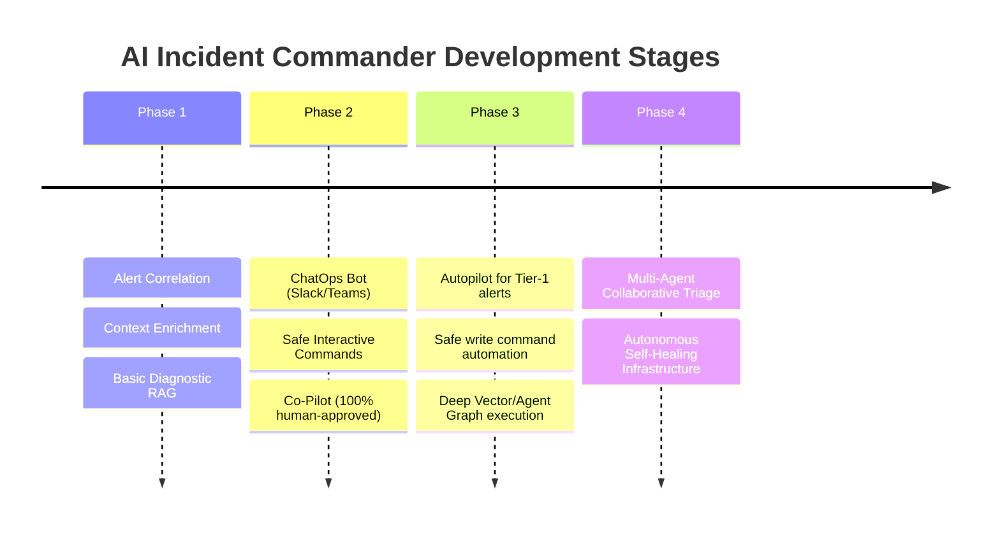

# Product Requirement Document (PRD)

## Project: AI Incident Commander (Autonomous SRE Co-Pilot)
**Author:** Principal Systems Architect / Product Lead  
**Status:** Draft  
**Date:** May 31, 2026

---

## 1. Business Problem & Market Context

Modern cloud-native architectures (Kubernetes, microservices, multi-cloud deployments) have increased system complexity exponentially. When production failures occur, engineers are faced with a deluge of telemetry data across disjointed tools (logs, metrics, APM traces).

### Key Pain Points:
1. **High Mean Time to Resolution (MTTR):** SREs spend up to 80% of their incident-response time querying logs, running diagnostic commands, and finding context rather than executing the actual fix. This directly translates to lost revenue and customer churn.
2. **Alert Fatigue & Cognitive Overload:** On-call rotations are flooded with low-fidelity alerts. Critical signals are often missed in the noise, leading to delayed responses.
3. **Tribal Knowledge & Static Runbooks:** Incident resolution documentation (runbooks) is frequently outdated, scattered across Wikis, or exists solely in the minds of senior engineers.
4. **Siloed Communication:** Coordinating engineering responses, updating business stakeholders, and drafting post-mortems are manual, error-prone tasks that distract from active triage.

**The Solution:** The *AI Incident Commander* acts as an intelligent, autonomous agent that ingests alerts, correlates system telemetry, queries infrastructure safely, suggests precise root-cause hypotheses, and guides engineers through interactive, safe runbook executions.

---

## 2. User Personas

| Persona | Role | Key Needs | Pain Points |
| :--- | :--- | :--- | :--- |
| **On-Call Engineer (SRE / Dev)** | Primary Responder | Rapid alert context, immediate diagnostics, safe command execution, and automated search of past incidents. | Alert fatigue, lack of familiarity with downstream services, and context-switching between monitoring tools. |
| **Incident Commander (Lead / Manager)** | Coordinator | High-level status updates, automated timelines, customer-facing messaging, and cross-team coordination. | Distracted by manually compiling incident timelines and writing updates for business stakeholders. |
| **Platform Administrator** | Governance & Ops | Enterprise-grade access control, strict security guardrails, audit logging, and LLM behavior compliance. | Fear of AI executing destructive commands (e.g., `rm -rf`, dropping production tables) or leaking telemetry data. |

---

## 3. Functional Requirements

### 3.1 Alert Ingestion, Deduplication, & Context Aggregation
* **FR-1.1 Multi-source Alert Ingestion:** System must ingest webhooks from PagerDuty, Opsgenie, Datadog, Prometheus Alertmanager, and CloudWatch.
* **FR-1.2 Semantic Correlation:** Group related alerts occurring in a tight temporal window (e.g., database connection timeout and frontend 500 errors) into a single "Incident Session".
* **FR-1.3 Automated Context Enrichment:** Upon incident creation, the agent must automatically fetch the preceding 15-minute logs, CPU/Memory metrics, and Kubernetes deployment history for the affected services.

### 3.2 AI-Powered Diagnostics & Root Cause Analysis (RCA)
* **FR-2.1 Situation Report (SitRep):** Generate a natural language summary explaining:
  * What is broken.
  * Which customers/endpoints are impacted.
  * When the anomaly started.
* **FR-2.2 Root Cause Hypothesis:** Propose the top 3 most likely root causes based on retrieved metrics, deployment changes, and historical incidents (e.g., "90% probability: Recent deployment `v1.2.4` introduced a DB connection leak").
* **FR-2.3 Retrieval-Augmented Generation (RAG):** Match current alert patterns against historical post-mortems and internal runbook repositories to suggest resolution paths.

### 3.3 Safe, Interactive Runbook Execution (Human-in-the-Loop)
* **FR-3.1 Command Suggestion:** Propose diagnostic commands (e.g., `kubectl logs`, `df -h`, `pg_stat_activity`) relevant to the system state.
* **FR-3.2 Command Guardrails & Execution:** Provide a sandbox to execute commands.
  * **Read-only Commands:** Run automatically or via one-click approval.
  * **State-Changing Commands:** (e.g., rolling back a deployment, restarting a service) MUST require multi-factor or peer approval depending on severity.
  * **Blocked Commands:** Statically analyze and block destructive patterns (e.g., `*`, `drop`, `delete`, `truncate` on production systems).

### 3.4 Orchestrated Communication & Collaboration
* **FR-4.1 ChatOps Integration:** Automatically spawn a dedicated Slack/Teams incident channel.
* **FR-4.2 Automated Periodic Summaries:** Post a progress update (e.g., "State: Triaging. Actions taken: Pods restarted. Impact: Decreasing") every 15 minutes to keep stakeholders informed without interrupting SREs.
* **FR-4.3 Draft Stakeholder Comms:** Generate draft status page updates and customer notifications for review by the Incident Commander.

### 3.5 Automated Post-Mortem & Incident Review
* **FR-5.1 Timeline Construction:** Reconstruct a minute-by-minute timeline of the incident, including alert triggers, engineer chats, commands run, and system recovery.
* **FR-5.2 Post-Mortem (RC) Draft:** Generate a markdown post-mortem containing:
  * Summary of event.
  * Root cause analysis.
  * Preventative actions checklist.
* **FR-5.3 Ticket Export:** Export the draft directly to Jira, Confluence, or GitHub Issues.

---

## 4. Non-Functional Requirements (NFRs)

### 4.1 Security & Compliance (Zero Trust)
* **NFR-1.1 RBAC Mapping:** All actions suggested by the LLM must execute under the calling user's IAM/RBAC credentials. The AI agent cannot escalate its own permissions.
* **NFR-1.2 Data Privacy & Masking:** Telemetry data (logs, traces) containing PII or secrets must be obfuscated/masked *before* being transmitted to external LLM providers.
* **NFR-1.3 Audit Trail:** Every single prompt, response, user approval, and executed command must be logged in a read-only, tamper-proof audit trail.

### 4.2 Reliability & High Availability
* **NFR-2.1 Out-of-Band Deployment:** The AI Incident Commander must be hosted independently of the production cluster it monitors, ensuring it remains operational during major system outages.
* **NFR-2.2 Fallback Operational Mode:** If the LLM provider is down, the system must fallback to heuristic-based rule matching of local runbooks.

### 4.3 Performance & Latency
* **NFR-3.1 Time-to-First-Hypothesis:** The automated diagnostic report must be posted to the Slack channel/UI within **60 seconds** of alert ingestion.
* **NFR-3.2 UI Responsiveness:** Runbook command suggestion and latency of manual control actions must be sub-second.

---

## 5. Success Metrics

| Metric | Target | How it is Measured |
| :--- | :--- | :--- |
| **Mean Time to Resolution (MTTR)** | 35% reduction | Tracked via incident duration in PagerDuty before vs. after implementation. |
| **Mean Time to Context (MTTC)** | < 2 minutes | Time from alert ingestion to the delivery of the enriched diagnostic report. |
| **RCA Accuracy** | > 80% | Post-incident user survey asking: "Was the AI's root-cause hypothesis accurate?" |
| **Command Acceptance Rate** | > 70% | Ratio of AI-suggested commands that are approved and run by the SRE. |
| **Post-Mortem Draft Time** | < 10 minutes | Manual time spent by Lead SREs drafting post-mortems after service restoration. |

---

## 6. Future Roadmap

### Phase 1: Context Co-pilot (Core Engine)
Focus on building ingestion APIs, RAG knowledge bases, and delivering enriched context summaries. The system is read-only at this stage.

### Phase 2: Active Responder (ChatOps & Verification)
Introduce interactive Slack bot commands, sandboxed command validation, and human-in-the-loop diagnostics. SREs trigger commands with one click.

### Phase 3: Autopilot
Enable autonomous remediation for highly defined, low-risk incidents (e.g., disk-space cleanup, scale-up on CPU bottlenecks) with instant rollback capabilities if health checks fail.

### Phase 4: Decentralized Multi-Agent Swarms
Deploy specialized subagents (e.g., DB Analyst Agent, Network Architect Agent, Log Forensic Agent) that communicate asynchronously to resolve complex cascading failures across systems.
