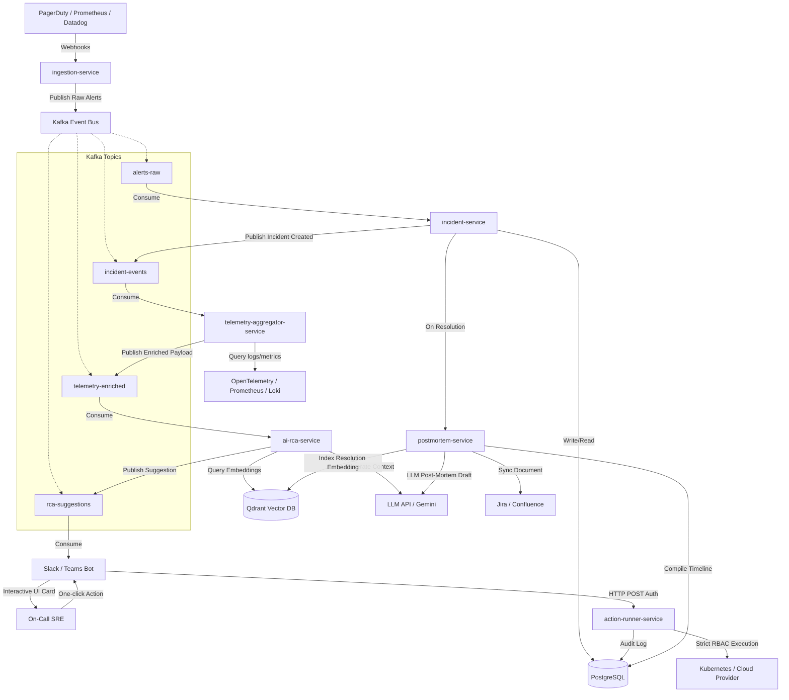
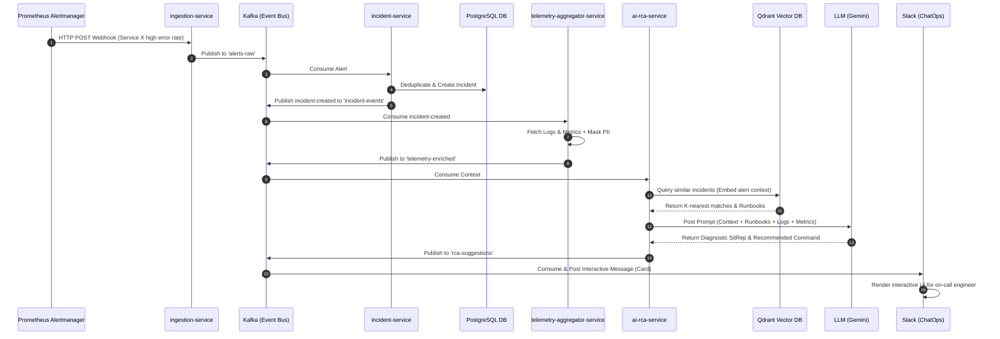
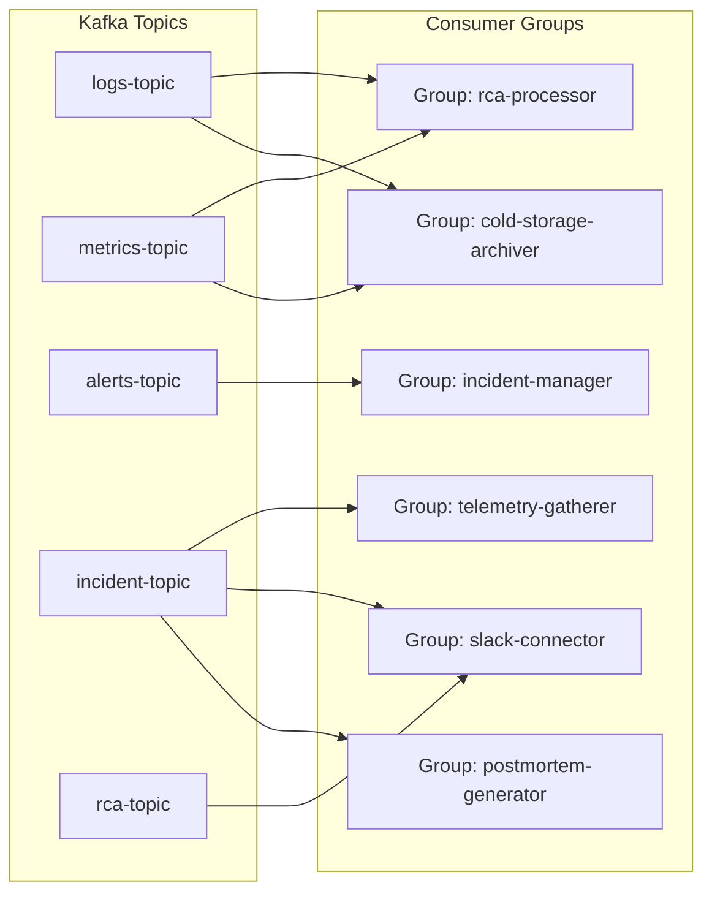
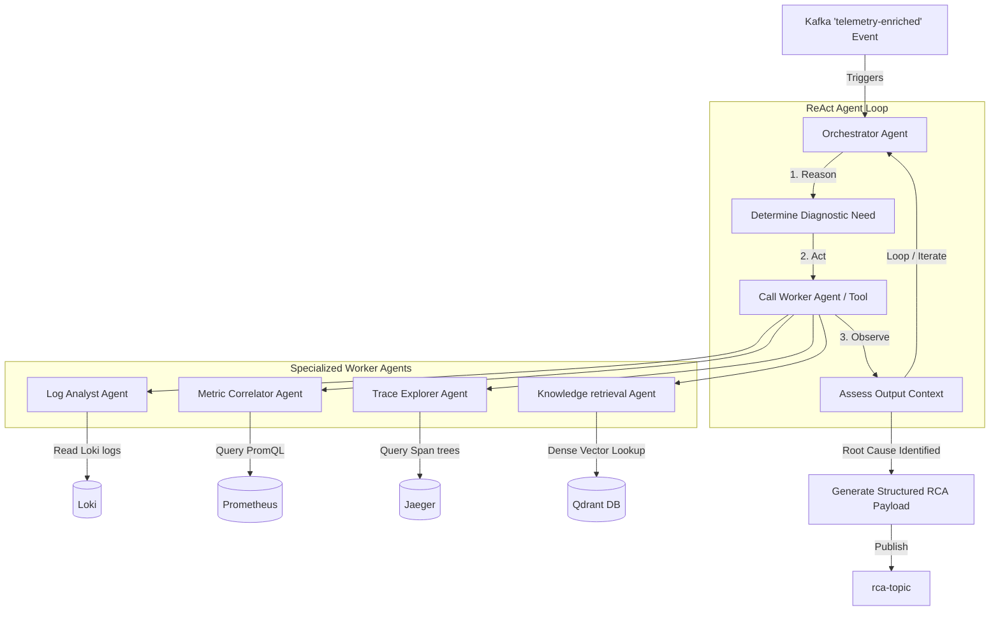
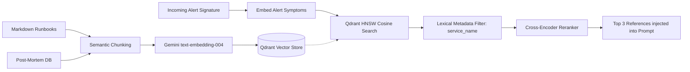

# Engineering Design Document: AI Incident Commander

**Author:** Staff Software Engineer  
**Status:** Under Review  
**Date:** May 31, 2026

---

## 1. System Architecture

The AI Incident Commander is built on an event-driven microservices architecture. It leverages **Kafka** as the central event bus for decoupling ingestion, processing, and agent orchestration. The system uses **PostgreSQL** for relational metadata and state tracking, **Qdrant** as a vector database for semantic RAG (Retrieval-Augmented Generation), and **OpenTelemetry** for end-to-end tracing and metric ingestion.



---

## 2. Service Boundaries

Below are the 6 microservices that constitute the AI Incident Commander platform, listing their responsibilities, API interfaces, and dependencies.

### Service 1: `ingestion-service`
* **Responsibilities:**
  * Exposes high-throughput webhook endpoints to receive alerts from telemetry sources.
  * Validates alert payloads against schema registries.
  * Normalizes third-party alerts into a standard internal event format.
  * Publishes raw alerts to the `alerts-raw` Kafka topic.
* **APIs / Protocols:**
  * `POST /api/v1/webhooks/{source}` (HTTP/REST)
* **Dependencies:** Kafka client.

### Service 2: `incident-service`
* **Responsibilities:**
  * Consumes raw alerts from `alerts-raw`.
  * Runs a real-time temporal and structural deduplication engine.
  * Maps alert metadata to define/group related alerts into a single "Incident" entity.
  * Manages the Incident lifecycle (State Machine: `Triggered` -> `Acknowledged` -> `Triaging` -> `Mitigated` -> `Resolved`).
  * Publishes lifecycle events to `incident-events`.
  * Manages relational metadata storage.
* **APIs / Protocols:**
  * `GET /api/v1/incidents` (HTTP/REST)
  * `PATCH /api/v1/incidents/{id}` (HTTP/REST)
* **Dependencies:** PostgreSQL, Kafka client.

### Service 3: `telemetry-aggregator-service`
* **Responsibilities:**
  * Consumes lifecycle events from `incident-events`.
  * Queries downstream systems (Loki, Prometheus, Elastic, Jaeger) for the specific target service's logs, metrics, and traces covering `T - 15m` to `T + 5m`.
  * Filters and groups metrics (e.g., CPU spikes, HTTP error ratios).
  * Obfuscates and masks personally identifiable information (PII) or credentials in logs.
  * Publishes masked logs and metric reports to `telemetry-enriched`.
* **APIs / Protocols:** Internal RPC (gRPC) or Kafka-triggered execution.
* **Dependencies:** Prometheus API, Loki API, OpenTelemetry collector, Kafka.

### Service 4: `ai-rca-service`
* **Responsibilities:**
  * Consumes enriched telemetry payloads from `telemetry-enriched`.
  * Performs semantic dense search query against Qdrant to retrieve historical incidents and matched troubleshooting runbooks.
  * Builds prompt payloads containing: Current Symptoms, Active Logs, Metrics, Matching Runbooks, and Past Incidents.
  * Orchestrates LLM reasoning chains to yield: a Situation Report (SitRep), Root Cause hypothesis, and safe remediation commands.
  * Publishes proposals to `rca-suggestions`.
* **APIs / Protocols:** LLM API client, gRPC client.
* **Dependencies:** Qdrant DB, Gemini API, Kafka.

### Service 5: `action-runner-service`
* **Responsibilities:**
  * Exposes secure command execution endpoints.
  * Maps incoming executing user identity (JWT/Slack OIDC token) to target environment RBAC.
  * Validates requested commands against structural security guardrails (denylists/whitelists).
  * Executes authorized tasks on target clusters (Kubernetes namespaces, cloud resources).
  * Records execution outcomes in the audit trail.
* **APIs / Protocols:**
  * `POST /api/v1/actions/execute` (HTTP/mTLS)
* **Dependencies:** Kubernetes API, Vault (for secret injection), PostgreSQL (Audit log).

### Service 6: `postmortem-service`
* **Responsibilities:**
  * Listens for `RESOLVED` events from `incident-events`.
  * Aggregates chat logs from Slack, audit logs from execution runs, and raw alerts.
  * Calls LLM to synthesize a comprehensive timeline and post-mortem document.
  * Syncs post-mortem to Confluence and Jira.
  * Translates incident summary and resolution steps into vector embeddings and indexes them back into Qdrant.
* **APIs / Protocols:**
  * `POST /api/v1/postmortems/generate`
* **Dependencies:** PostgreSQL, Qdrant, Confluence API, Jira API.

---

## 3. Data Flow

The diagram below details the sequence of execution when a production alert fires:



---

## 4. Database Design (PostgreSQL & Qdrant)

### 4.1 PostgreSQL Schema (Relational Store)

We use PostgreSQL for transactional data, incident lifecycles, and audit logging.

```sql
-- Core Incidents Table
CREATE TABLE incidents (
    id UUID PRIMARY KEY DEFAULT gen_random_uuid(),
    service_name VARCHAR(128) NOT NULL,
    status VARCHAR(32) NOT NULL DEFAULT 'TRIGGERED', -- TRIGGERED, ACKNOWLEDGED, TRIAGING, MITIGATED, RESOLVED
    severity VARCHAR(16) NOT NULL,                    -- SEV-1, SEV-2, SEV-3
    summary TEXT,
    created_at TIMESTAMP WITH TIME ZONE DEFAULT CURRENT_TIMESTAMP,
    acknowledged_at TIMESTAMP WITH TIME ZONE,
    resolved_at TIMESTAMP WITH TIME ZONE,
    slack_channel_id VARCHAR(64)
);

-- Alerts Linked to Incident
CREATE TABLE alerts (
    id UUID PRIMARY KEY DEFAULT gen_random_uuid(),
    incident_id UUID REFERENCES incidents(id) ON DELETE CASCADE,
    source VARCHAR(64) NOT NULL, -- prometheus, datadog, pagerduty
    raw_payload JSONB NOT NULL,
    created_at TIMESTAMP WITH TIME ZONE DEFAULT CURRENT_TIMESTAMP
);

-- Command Execution Audit Trail
CREATE TABLE audit_logs (
    id UUID PRIMARY KEY DEFAULT gen_random_uuid(),
    incident_id UUID REFERENCES incidents(id),
    operator_user VARCHAR(128) NOT NULL, -- User ID from Slack or SSO ID
    command TEXT NOT NULL,
    status VARCHAR(32) NOT NULL,         -- PENDING, APPROVED, EXECUTED, FAILED, BLOCKED
    executed_at TIMESTAMP WITH TIME ZONE DEFAULT CURRENT_TIMESTAMP,
    output_hash VARCHAR(64) NOT NULL,    -- SHA-256 hash of execution output
    output_preview TEXT                  -- Safe truncated preview of stdout/stderr
);

-- Post-Mortem Documentation
CREATE TABLE post_mortems (
    id UUID PRIMARY KEY DEFAULT gen_random_uuid(),
    incident_id UUID REFERENCES incidents(id) UNIQUE,
    title VARCHAR(256) NOT NULL,
    timeline JSONB NOT NULL,             -- Chronological event log
    content_markdown TEXT NOT NULL,
    created_at TIMESTAMP WITH TIME ZONE DEFAULT CURRENT_TIMESTAMP
);
```

### 4.2 Qdrant Vector Storage Schema

We maintain two collections in **Qdrant**:

#### Collection: `historical_incidents`
* **Vector Dimension:** 1536 (using `text-embedding-004`)
* **Metric:** Cosine Similarity
* **Payload Structure:**
  ```json
  {
    "incident_id": "uuid-string",
    "service_name": "payment-processor",
    "summary": "Database connection pool exhausted due to idle transactions.",
    "resolution_steps": "Ran DB pool scale script. Adjusted config environment variables in K8s deployment.",
    "severity": "SEV-1",
    "resolved_at_timestamp": 1780281600
  }
  ```

#### Collection: `runbooks`
* **Vector Dimension:** 1536
* **Metric:** Cosine Similarity
* **Payload Structure:**
  ```json
  {
    "runbook_id": "uuid-string",
    "name": "DB Pool Exhaustion Troubleshooting",
    "target_service": "common-database",
    "trigger_symptoms": "High connection latency, 504 gateway timeouts",
    "safe_commands": [
      "kubectl exec -it {pod_name} -- pg_isready",
      "kubectl logs deployment/payment-processor --tail=200"
    ],
    "remediation_commands": [
      "kubectl rollout restart deployment/payment-processor"
    ]
  }
  ```

---

## 5. Kafka Topic Design (Scaled for 1 Million Events/Day)

### 5.1 Sizing & Throughput Calculations
* **Total Traffic:** 1,000,000 events/day.
* **Average Throughput:** ~11.57 events/sec.
* **Peak Surge Factor:** 25x (during cascading major system incidents/alert storms).
* **Peak Sizing Target:** 300 events/sec.
* **Average Payload Size:**
  * Logs: 5 KB per log block event.
  * Metrics: 2 KB per metrics snapshot.
  * Alerts/Incidents/RCA: 1.5 KB per metadata event.
* **Aggregated Peak Bandwidth:** `(300 events/sec * 5 KB) = 1.5 MB/sec` (well within standard single-broker or small cluster IO bounds).

### 5.2 Topic Configuration Matrix

| Topic Name | Target Partition Count | Partition Key | Retention Period | Cleanup Policy | Purpose |
| :--- | :--- | :--- | :--- | :--- | :--- |
| **`logs-topic`** | 6 Partitions | `incident_id` | 7 Days (`retention.ms=604800000`) | `delete` | Carries snapshot log streams fetched for active incident reasoning. Keying by `incident_id` ensures sequential order. |
| **`metrics-topic`** | 6 Partitions | `incident_id` | 7 Days (`retention.ms=604800000`) | `delete` | Distributes structured time-series metrics data points relevant to the incident window. |
| **`alerts-topic`** | 4 Partitions | `service_name` | 30 Days (`retention.ms=2592000000`) | `delete` | Ingests firing raw alert payloads. Keying by `service_name` guarantees alert deduplication order per microservice. |
| **`incident-topic`** | 3 Partitions | `incident_id` | 365 Days (`retention.ms=31536000000`) | `compact,delete` | Broadcasts state transitions (CREATED, ACK, RESOLVED). Compaction preserves the latest status for active incidents. |
| **`rca-topic`** | 3 Partitions | `incident_id` | 90 Days (`retention.ms=7776000000`) | `delete` | Broadcasts AI-generated root cause hypotheses, diagnostics, and suggested commands. |

---

### 5.3 Consumer Groups & Routing Topology



#### Consumer Group 1: `incident-manager`
* **Subscribed Topic:** `alerts-topic`
* **Responsibility:** Running deduplication logic, instantiating new incidents, and linking secondary alerts to ongoing incident IDs in PostgreSQL.

#### Consumer Group 2: `telemetry-gatherer`
* **Subscribed Topic:** `incident-topic` (Filters on `CREATED` events)
* **Responsibility:** Automatically triggers queries to Loki and Prometheus, obfuscates PII data, and publishes the resulting telemetry payload to `logs-topic` and `metrics-topic`.

#### Consumer Group 3: `rca-processor`
* **Subscribed Topics:** `logs-topic`, `metrics-topic` (Co-partitioned join on `incident_id`)
* **Responsibility:** Combines log traces and metrics snapshots, queries the Qdrant vector database for matching historical cases, runs the LLM diagnostic chain, and publishes output to `rca-topic`.

#### Consumer Group 4: `slack-connector`
* **Subscribed Topics:** `incident-topic`, `rca-topic`
* **Responsibility:** Posts rich notifications to Slack, creates dedicated channels on `incident-created`, and posts interactive diagnostics cards on receipt of `rca-topic` events.

#### Consumer Group 5: `postmortem-generator`
* **Subscribed Topic:** `incident-topic` (Filters on `RESOLVED` events)
* **Responsibility:** Triggers the post-mortem compilation workflow, compiles timelines, and pushes documents to Jira/Confluence.

#### Consumer Group 6: `cold-storage-archiver`
* **Subscribed Topics:** `logs-topic`, `metrics-topic`
* **Responsibility:** Periodically batches raw events to compressed Parquet files and ships them to S3/GCS cold storage for long-term historical audits.

---

## 6. API Contracts

All microservices write APIs conforming to OpenAPI 3.0 specification.

### 6.1 `POST /api/v1/webhooks/{source}` (ingestion-service)
* **Request Headers:** `X-Webhook-Signature: sha256=...`
* **Request Body:** (PagerDuty Example)
  ```json
  {
    "event": "incident.triggered",
    "service_name": "payment-gateway",
    "details": {
      "summary": "HTTP 500 Spike on /checkout",
      "severity": "CRITICAL"
    }
  }
  ```
* **Response:** `202 Accepted` -> `{"status": "queued", "alert_id": "uuid"}`

### 6.2 `POST /api/v1/actions/execute` (action-runner-service)
* **Request Headers:** `Authorization: Bearer <JWT_Token>` (maps to IAM context)
* **Request Body:**
  ```json
  {
    "incident_id": "550e8400-e29b-41d4-a716-446655440000",
    "command": "kubectl get pods -n backend -l app=payment-gateway",
    "override_reason": "Verifying pod health during SEV-1 ticket"
  }
  ```
* **Response:** `200 OK`
  ```json
  {
    "execution_id": "789e8400-e29b-41d4-a716-446655449999",
    "status": "SUCCESS",
    "stdout": "NAME                               READY   STATUS    RESTARTS   AGE\npayment-gateway-55c68b75fc-7nzq6   1/1     Running   4          12d",
    "stderr": ""
  }
  ```

---

## 7. AI Root Cause Analysis (RCA) Pipeline Design

The AI RCA Pipeline operates inside the `ai-rca-service` using an orchestrator-agent pattern. It integrates RAG-based context lookup with multi-step reasoning tools to formulate diagnostic hypotheses.

### 7.1 Agent Architecture & Diagnostic Loop

The pipeline is structured as an **Orchestrator-Worker Multi-Agent System** that executes a ReAct (Reasoning and Acting) loop:



#### Specialized Worker Roles & Tools:
1. **Orchestrator Agent (LLM Core):** Manages the state machine of the diagnostic run. It analyzes symptoms and delegates deep-dive tasks to worker agents.
2. **Log Analyst Agent:** Equipped with Loki search APIs. It performs keyword regex queries, error counting, and stack-trace extraction.
3. **Metric Correlator Agent:** Queries Prometheus data. It automatically pulls CPU, memory, thread counts, IOPS, and network usage.
4. **Trace Explorer Agent:** Interfaces with Jaeger/OpenTelemetry. It traverses span trees to identify downstream services causing bottleneck propagation or database connection blockages.
5. **Knowledge Retrieval Agent:** Vectorizes alert signatures and queries the Qdrant DB for historical post-mortems and matching runbooks.

---

### 7.2 Prompt Design & Structural Enforcement

To enforce deterministic, parser-safe outputs, the Orchestrator Agent utilizes a rigid prompt structure combined with Gemini JSON Schema formatting constraints.

#### System Prompt Template:
```text
Role: You are the Lead SRE AI Incident Commander.
Task: Analyze system telemetry (logs, metrics, traces) and historical context to determine the root cause of the incident.
Instructions:
1. Be extremely concise. Avoid speculative language.
2. Build an evidence chain listing the exact events, metrics, or logs backing your conclusion.
3. Assess a confidence score (0.0 to 1.0) based on telemetry completeness.
4. Provide structured, safe remediation steps, mapping diagnostic commands vs. write rollbacks.
5. You must output strictly conformant JSON matching the provided schema. Do not wrap in markdown blocks.
```

#### Context Ingestion Layout:
```text
=== INCIDENT METADATA ===
Incident ID: {incident_id}
Target Service: {service_name}
Severity: {severity}

=== PRIMARY ALERT SYMPTOMS ===
{alert_payload_json}

=== HISTORICAL RUNBOOKS & INCIDENTS (RAG Matches) ===
1. Runbook: {runbook_name_1}
   - Context: {runbook_description_1}
   - Safe Commands: {runbook_commands_1}
2. Past Case: {past_summary_2}
   - Resolution: {past_resolution_2}

=== ENRICHED TELEMETRY (Logs / Traces / Metrics) ===
[LOGS SNIPPET]
{masked_logs_raw}

[METRIC RATIOS]
{prometheus_time_series_data}

[TRACE BOTTLE-NECK ANALYSIS]
{jaeger_slowest_spans}
```

#### JSON Output Schema (Target Output):
```json
{
  "$schema": "http://json-schema.org/draft-07/schema#",
  "title": "RcaPayload",
  "type": "OBJECT",
  "properties": {
    "root_cause": {
      "type": "STRING",
      "description": "Clear statement of the validated root cause."
    },
    "confidence_score": {
      "type": "NUMBER",
      "minimum": 0.0,
      "maximum": 1.0,
      "description": "Numerical score showing AI confidence in the hypothesis."
    },
    "evidence_chain": {
      "type": "ARRAY",
      "items": {
        "type": "OBJECT",
        "properties": {
          "source": { "type": "STRING", "enum": ["LOGS", "METRICS", "TRACES", "KNOWLEDGE_BASE"] },
          "description": { "type": "STRING", "description": "Specific finding (e.g., CPU spiked to 98% at 14:02:10)" },
          "raw_reference": { "type": "STRING", "description": "Raw log line snippet or Prometheus query expression" }
        },
        "required": ["source", "description"]
      }
    },
    "remediation_steps": {
      "type": "ARRAY",
      "items": {
        "type": "OBJECT",
        "properties": {
          "step_number": { "type": "INTEGER" },
          "action_type": { "type": "STRING", "enum": ["DIAGNOSTIC", "REMEDIATION_READONLY", "REMEDIATION_WRITE"] },
          "command": { "type": "STRING", "description": "Shell command or API invocation sequence" },
          "description": { "type": "STRING", "description": "Explanation of the command outcome" }
        },
        "required": ["step_number", "action_type", "command", "description"]
      }
    }
  },
  "required": ["root_cause", "confidence_score", "evidence_chain", "remediation_steps"]
}
```

---

### 7.3 RAG Strategy (Qdrant Retrieval Pipeline)

Retrieving semantic context is split into a multi-step ingestion, search, and ranking architecture:



1. **Semantic Chunking:**
   * Runbooks are chunked by headers (`### Diagnostic Section`).
   * Post-mortems are chunked to keep Summary, Symptoms, and Resolution steps within a single semantic segment (typically 500-800 tokens), preserving temporal context.
2. **Dense Embeddings:**
   * Generated using Gemini `text-embedding-004` API, producing a 1536-dimensional float vector.
3. **Retrieval Filters:**
   * Before vector calculations, metadata pre-filtering is run in Qdrant (e.g., `service_name == 'payment-gateway'`). This scopes vectors to relevant application domains.
4. **HNSW Cosine Search:**
   * Executes a vector search using Hierarchical Navigable Small World (HNSW) graphs in Qdrant, retrieving the Top-10 matches based on Cosine distance.
5. **Cross-Encoder Re-ranking:**
   * Uses a lightweight cross-encoder model to re-score the Top-10 matches against the raw telemetry input. This resolves semantic mismatch issues where standard embeddings fail on specific error codes.
   * The top 3 re-ranked matches are selected and formatted into the Orchestrator prompt context.

---

## 8. Security Model

Security is paramount when connecting an AI orchestrator to active infrastructure.

1. **Least-Privilege Execution (RBAC):**
   * The `action-runner-service` executes operations inside a Kubernetes cluster under a dedicated ServiceAccount.
   * Actions must validate that the initiating Engineer’s JWT has the equivalent permission in Kubernetes RBAC (backed by OIDC/Kubernetes TokenReview).
2. **PII Masking Pipeline (`telemetry-aggregator-service`):**
   * Pre-compiles regex patterns matching credentials, API tokens, credit cards, emails, and IPv4 addresses.
   * Runs logs through a tokenization stage, replacing private values with placeholders (e.g., `[STRIPPED_IP]`, `[STRIPPED_SECRET]`) prior to sending to vector stores or LLM endpoints.
3. **Command Guardrails Engine:**
   * Uses a lexer shell parser to validate proposed terminal commands.
   * **Denylist:** Restricts characters and operators like `;`, `&`, `|`, `>` (to prevent script injection) and denies dangerous prefixes (`rm`, `sudo`, `dd`, `chown`).
   * **State Changes:** Commands modifying deployment settings trigger multi-engineer consensus approval via Slack buttons.

---

## 9. Scalability Strategy

1. **State Partitioning in Kafka:**
   * Alert and telemetry processing scale horizontally by spinning up multiple consumer replicas inside K8s. By keying partition logs on `incident_id`, we guarantee linear ordering of updates per incident while enabling concurrent workers across different incidents.
2. **LLM Semantic Caching:**
   * A Redis cluster acts as a semantic caching database. If alert symptoms index a cosine similarity of > 0.98 compared to an active incident cache in Redis, the LLM diagnostic request is skipped, and cached recommendations are served instantly, saving latency and API cost.
3. **Vector Database Sharding:**
   * Qdrant collections partition vectors across multiple nodes. Indexes are held in memory (RAM-cached HNSW indexes) to keep query retrieval times under 15ms.

---

## 10. Deployment Architecture

Services run inside a **Kubernetes (EKS / GKE)** cluster. Observability traces are monitored through OpenTelemetry SDKs running within FastAPI, communicating with the OpenTelemetry Collector daemon.

```yaml
# Sample Kubernetes Deployment structure for ai-rca-service
apiVersion: apps/v1
kind: Deployment
metadata:
  name: ai-rca-service
  namespace: incident-commander
spec:
  replicas: 3
  selector:
    matchLabels:
      app: ai-rca-service
  template:
    metadata:
      labels:
        app: ai-rca-service
    spec:
      containers:
      - name: app
        image: incident-commander/ai-rca-service:v1.0.0
        ports:
        - containerPort: 8000
        env:
        - name: DATABASE_URL
          valueFrom:
            secretKeyRef:
              name: db-secrets
              key: url
        - name: KAFKA_BOOTSTRAP_SERVERS
          value: "kafka.event-bus:9092"
        resources:
          limits:
            cpu: "2"
            memory: 2Gi
          requests:
            cpu: "500m"
            memory: 512Mi
        readinessProbe:
          httpGet:
            path: /healthz
            port: 8000
          initialDelaySeconds: 5
          periodSeconds: 10
---
apiVersion: autoscaling/v2
kind: HorizontalPodAutoscaler
metadata:
  name: ai-rca-service-hpa
  namespace: incident-commander
spec:
  scaleTargetRef:
    apiVersion: apps/v1
    kind: Deployment
    name: ai-rca-service
  minReplicas: 3
  maxReplicas: 10
  metrics:
  - type: Resource
    resource:
      name: cpu
      target:
        type: Utilization
        averageUtilization: 75
```
