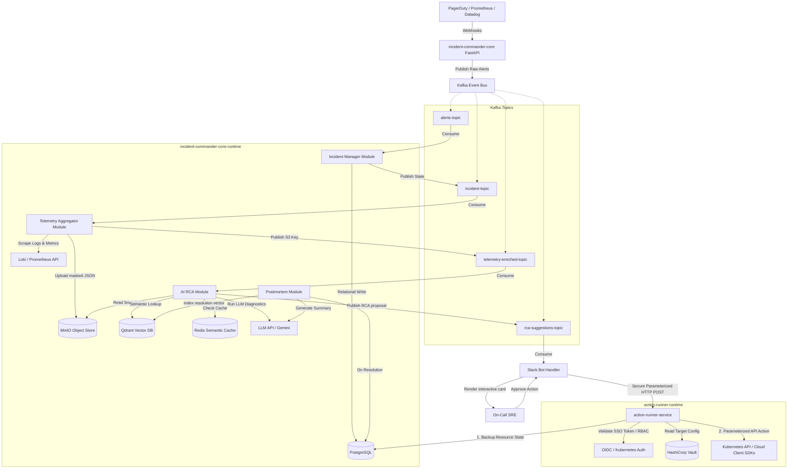
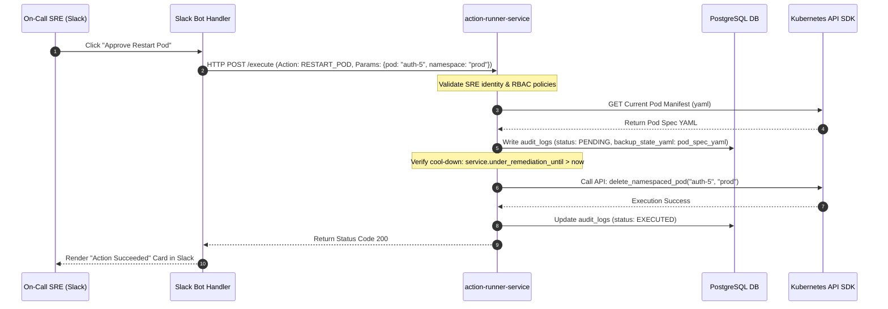

# Engineering Design Document: AI Incident Commander (Redesigned)

**Author:** Staff Software Engineer  
**Status:** Approved  
**Date:** June 7, 2026

---

## 1. System Architecture

The AI Incident Commander platform is redesigned around a **Modular Monolith** core service coupled with a highly isolated, high-security **Action Runner microservice**. The platform uses **Kafka** for event coordination, **PostgreSQL** for relational metadata and state tracking, **MinIO** for telemetry snapshot storage, **Redis** for semantic caching, and **Qdrant** for semantic vector matching.



---

## 2. Service Boundaries & Monorepo Runtimes

### Runtime 1: `incident-commander-core` (Modular Monolith)
To eliminate container overhead, networking latency, and distributed state coordination issues for the average load of 1M events/day, the core functionalities are consolidated into a single application package. Inter-module communication is event-driven via Kafka or asynchronous via internal job queues (Celery/redis).
*   **Modules:**
    *   `ingestion-module`: FastAPI routers exposing alert webhooks.
    *   `incident-module`: Consumer group for alert deduplication and lifecycle state machine.
    *   `telemetry-module`: Loki/Prometheus query orchestrator and PII data scrubbing utility.
    *   `ai-rca-module`: Qdrant retriever, Redis semantic caching layer, and LLM prompt orchestrator.
    *   `postmortem-module`: Post-incident aggregator, timeline generator, and Jira/Confluence synchronizer.
*   **Storage Access:** Reads/writes to PostgreSQL, uploads files to MinIO, queries Qdrant, reads/writes to Redis.

### Runtime 2: `action-runner-service` (Isolated Security Microservice)
Kept strictly decoupled from the core monolithic application. This runtime runs inside a high-security network zone and requires direct admin credentials to the production Kubernetes clusters and cloud providers.
*   **Responsibilities:**
    *   Exposes a single secure execution endpoint.
    *   Validates user identity context (Slack SSO token mapped to IAM roles).
    *   Queries Kubernetes cluster manifests to back up resource states prior to modifications.
    *   Executes actions strictly using official Python Client SDKs (e.g., `kubernetes` library, `boto3`) to prevent shell injection.
*   **Storage Access:** Writes transaction audits directly to PostgreSQL.

---

## 3. Kafka Topology & Event Sizing

Redesigned to optimize broker resources and eliminate stream join issues.

| Topic Name | Partitions | Partition Key | Schema Format | Purpose |
| :--- | :--- | :--- | :--- | :--- |
| `alerts-topic` | 3 | `service_name` | Avro (`AlertPayload.avsc`) | Ingests webhook raw alerts. Keyed by service name to force serial processing per service. |
| `incident-topic` | 2 | `incident_id` | Avro (`IncidentEvent.avsc`) | Broadcasts status updates (CREATED, ACKNOWLEDGED, RESOLVED). |
| `telemetry-enriched-topic` | 3 | `incident_id` | Avro (`TelemetryEnriched.avsc`) | Publishes the reference metadata and **MinIO S3 object keys** of scrubbed log/metric blocks. |
| `rca-suggestions-topic` | 2 | `incident_id` | Avro (`RcaSuggestion.avsc`) | Broadcasts AI diagnostic summaries and recommended parameterized action configurations. |

---

## 4. Secure Action-Runner Model & Loop Control



### 4.1 Auto-Remediation Loop Prevention (Cool-down)
*   When a state-changing action runs, the `services` table update sets `under_remediation_until = NOW() + INTERVAL '15 minutes'`.
*   During this cool-down window, the `incident-manager` module discards incoming telemetry alerts for this service, preventing cascading re-runs.

### 4.2 Parameterized Execution Guardrails
*   **Zero Shell execution:** The runner does NOT run `subprocess.run("kubectl delete pod ...", shell=True)`.
*   **Whitelisted SDK Calls:** The runner calls:
    ```python
    from kubernetes import client, config
    config.load_incluster_config()
    v1 = client.CoreV1Api()
    v1.delete_namespaced_pod(name=pod_name, namespace=namespace)
    ```
*   Arguments are validated via strict Pydantic schemas (e.g. namespace must match `^[a-z0-9-]+$`).

---

## 5. Scalability Strategy & Redis Semantic Cache

During severe alert storms, LLM APIs throttle requests. To scale under peak surges:
1.  **Metric Aggregation:** Webhook alerts are throttled at the service level; only one AI evaluation loop executes per service incident session.
2.  **Semantic Caching Flow:**
    ```text
    Alert Event -> Generate Alert Embedding Vector
               -> Search Redis Cache (Cosine Similarity)
               -> IF similarity > 0.98:
                      Serve cached RCA payload instantly (Latency: < 15ms, cost: $0.00)
               -> ELSE:
                      Invoke Gemini API Reasoning chain
                      Write Gemini output to Redis Cache (TTL: 5 minutes)
    ```

---

## 6. Deprecated Architectural Components

The following components from the previous design are **deprecated**:
1.  **Deprecated microservices:** `ingestion-service`, `incident-service`, `telemetry-aggregator-service`, `ai-rca-service`, and `postmortem-service` are deprecated as standalone processes and merged into the modular monolith `incident-commander-core`.
2.  **Deprecated Kafka Topics:**
    *   `logs-topic` & `metrics-topic` are deprecated to avoid streaming join complexities.
    *   `alerts-raw` is replaced by `alerts-topic`.
    *   `incident-events` is replaced by `incident-topic`.
    *   `telemetry-enriched` is replaced by `telemetry-enriched-topic` (using S3 object keys).
    *   `rca-suggestions` is replaced by `rca-suggestions-topic`.
3.  **Deprecated database storage:** Relational storage of raw diagnostic log rows (`logs` table) in PostgreSQL is deprecated.
4.  **Deprecated CLI execution:** Shell execution pipelines (`shell=True` subprocesses) inside the action-runner are deprecated.
